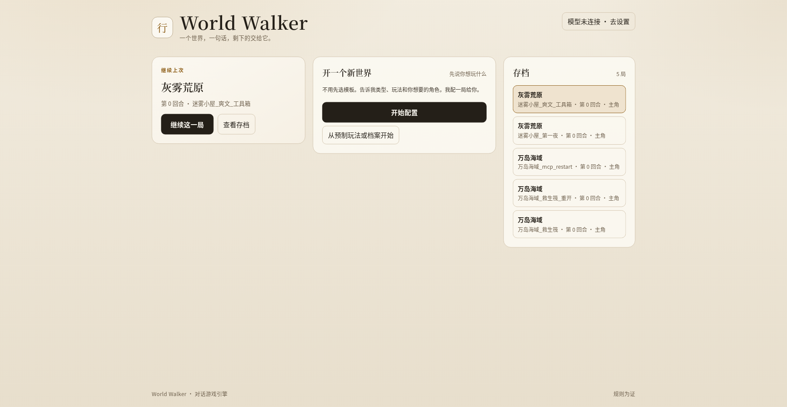
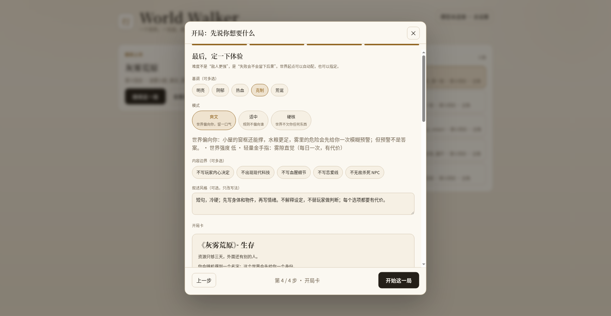
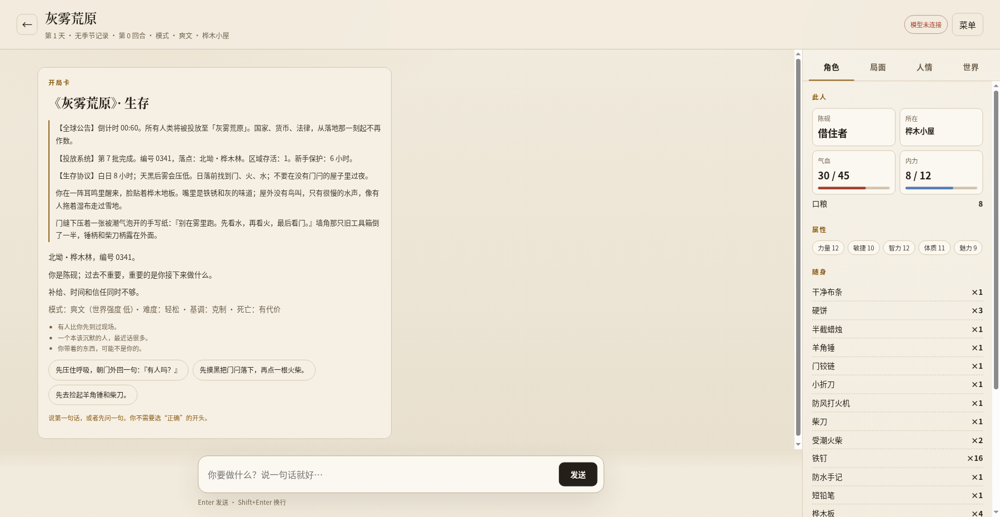

# World Walker

**v1.18.0** · English · [简体中文](README.zh-CN.md) · [Architecture](ARCHITECTURE.md) · [MCP mode](docs/MCP_PLAY.md) · [Changelog](CHANGELOG.md)

World Walker is a single-player AI tabletop RPG engine. You talk to the GM in plain language; a deterministic rules engine owns checks, prices, inventory, relationships, saves and replay. Any OpenAI-compatible `/chat/completions` endpoint can drive the story.

No host app. No provider lock-in. The model writes the scene; the engine owns the truth.

`221 rule functions` · `73 MCP tools` · `28 player tools` · `7 setting bundles` · `9 templates` · `24 self-check suites` · `0 runtime dependencies`

## Screens

| Lobby | Knowledge library | Mode picker | Cold open | At the table |
| --- | --- | --- | --- | --- |
|  |  |  |  |  |

## Why it exists

Most AI RPGs fail in the same places. World Walker puts the boundaries in the engine, not in a longer prompt.

- **The GM cannot play your character.** It describes the world and NPCs; your decisions stay yours.
- **NPCs only know what they have seen.** A character cannot quote facts outside their witnessed memory.
- **A turn must leave a trace.** Every reply carries a scene card and an audit; a turn without a visible consequence is flagged.

A campaign is built at the table, not pre-written. Session Zero asks genre, play style, role, tone, mode (power / balanced / hardcore) and boundaries. Then each turn runs `scene card → your action → world reaction → state change → next hook`.

## Install and play

```bash
pip install -e ".[mcp]"      # core uses only the standard library; mcp is optional
wg init my-game.json
wg play --state my-game.json
```

`wg play` opens the local page at `http://127.0.0.1:8899/`. Continue a save or start a new world. The player view is one screen: narrative on the left, a narrow character and quest rail on the right, one input at the bottom.

`wg` is the entry point: `init`, `setup`, `play`, `serve`, `mcp`, `run`, `doctor`, `version`. `wg --help` lists the rest.

`wg setup` writes the five built-in narrative skill packs, a director note and two table rules to `~/.world-walker/harness.json` with `0600` permissions. An existing config is kept; use `--force` to rewrite it.

## Knowledge library

The lobby's “Start from a prefab or archive” entry offers two selectable starts: island survival in the Ten Thousand Islands Sea, and fog-cabin survival in Grey Fog Waste. Every world can be started in one of three modes: **Power** (more starting supplies and room to recover; all gains are countable goods or stamina that can be used up or taken), **Balanced** (no favour, no sabotage), and **Hardcore** (scarce resources, faster clocks, permadeath). The fog-cabin Power kit is a second-hand hardware box: 4 boards, 16 nails, 1 hinge, a 10 m rope rated 40 kg, a mechanical thermometer/hygrometer, a windproof lighter rated for about 80 ignitions, a 500 g claw hammer and a 28 cm billhook. The character also has hauling strength from working in the family shop: STR 12 against a 10 baseline, enough to shoulder 60 kg for 20 m. Every piece can be consumed, broken or taken; the billhook dulls after 20 cuts; Hardcore has no kit and no respawn. The prefab fixes the world, play loop, base difficulty, tone and narrative style; name, role, boundaries and what happens next still belong to the player.

“Design archives” holds the raft, prefab-authoring and release-discipline notes. The data lives in `library/playbooks/*.json` and `library/archives/*.md` and ships with the package.

### Three modes, one rules core

`load_setting(path=..., mode="power")` accepts `power`, `balanced` or `hardcore`. The mode changes starting HP and supplies, market temperature, initial clock pressure and the GM's narrative rule; the world's own `modes` block names the edge. Power is extra countable stock, a modest physical edge where a world supplies one, and softer market/clock pressure; never a mystery sense. The same three presets work for every setting bundle and template.

## Use your own model

The model layer only assumes an OpenAI-compatible endpoint:

```json
{ "base_url": "https://your-gateway/v1", "api_key": "sk-...", "model": "any-model" }
```

Set it in the model settings page, or use `WW_MODEL_BASE_URL`, `WW_MODEL_API_KEY` and `WW_MODEL_NAME`. The config lives at `~/.world-walker/model.json` with `0600` permissions.

## Tune the GM

The “Connect & tune → Narrative tuning” panel keeps four layers separate instead of folding taste, prompt packs and hard rules into one switch:

- **Prompt:** director notes and table rules are appended to the GM system prompt. They change the telling, not POLICY, CANON or numeric outcomes.
- **Narrative skills:** prompt packs under `narrative_skills/*.md`, each with a title and summary, injected only when enabled. These are not character skills.
- **Engine rules:** the current save's `rulebook`, ordered by `order`, limited to whitelisted effects. Validate and save from the panel; trigger counts are persisted. Rules can run at turn start or after every tool result.
- **Turn hooks:** `before_turn.py`, `after_tool.py` and `after_turn.py` under `~/.world-walker/hooks`. Off by default. They run with your own permissions — treat them as Python you wrote yourself.

Tuning config lives at `~/.world-walker/harness.json` with `0600` permissions. Prompts, skills, hooks and rules for an external agent still belong to its host; World Walker only supplies MCP tools and starting prompts.

## Connect an agent over MCP

```json
{ "mcpServers": { "world-walker": { "command": "world-walker-mcp" } } }
```

Any MCP client works. For remote agents, use HTTP instead of stdio:

```bash
wg mcp --http --port 8620
```

Then point the client at `http://127.0.0.1:8620/mcp`. A complete game can start with one setting bundle and one trade:

```
load_setting(path="settings/玄枢界.setting.json")
trade(location="临川城", item="ningyuan_dan", direction="buy", quantity=1)
```

The host calls tools only when a number is needed. Prose stays in the conversation.

## What the engine owns

- **Checks and combat:** d20, 2d6, d100, 4dF, dice pools, opposed rolls, damage and death rules.
- **Economy and people:** prices, inventory, relationships, reputation, debts and faction shifts.
- **World movement:** clocks, rumors, roaming NPCs, clues, quest stages and long-run consequences.
- **Replay:** one transactional writer, a command log with state fingerprints, and a save you can inspect.
- **Context boundaries:** NPC knowledge, canon facts, world book triggers and a scene card before every reply.

The player surface exposes 28 tools. The 73-tool MCP surface remains for advanced hosts. Both routes share the same rules, state file and writer.

## Quality

Verification is executable, not decorative. `scripts/verify_*.py`, behaviour regressions and mutation tests must fail when the code is wrong. The main gate runs 24 self-check suites, with coverage for the core domain and a zero-survivor mutation pass.

```bash
python3 scripts/verify_docs.py
python3 scripts/verify_player_shell.py
python3 scripts/verify_mcp_stdio.py
```

## Saves and failure

Saves use atomic replacement with a `.bak` fallback and a re-entrant Windows/POSIX lock. Crash tests cover several interruption windows.

If `<state>.archive-pending` or `.ww-session-transaction-pending` exists, protected reads and writes are refused. There is **no automatic recovery**: stop writing, preserve the evidence and review it manually. Restoring the caller's in-memory state after a failed save is **not an archive rollback**. See [the archive recovery guide](docs/ARCHIVE_RECOVERY.md).

## Scope

Built for single-player AI GM play, setting bundles, local saves and MCP hosts. Deliberately not multiplayer, cloud accounts, a plugin marketplace or pre-written campaigns sold as content.

## Project layout

```
world-walker/                  # repo root is the game_engine package
├── panel.py                   # player HTTP/SSE server and game APIs
├── dialog_runtime.py          # GM prompt, tool loop, turn finish and audit
├── narrative_rules.py         # Session Zero, scene cards, turn audit
├── rules/                     # deterministic settlement
├── settings/                  # seven ready-to-play worlds
├── saves/                     # local save library
└── scripts/                   # verification and build tools
```

## License

MIT. Demo names, factions and places are original; no setting material from existing works is reused.
